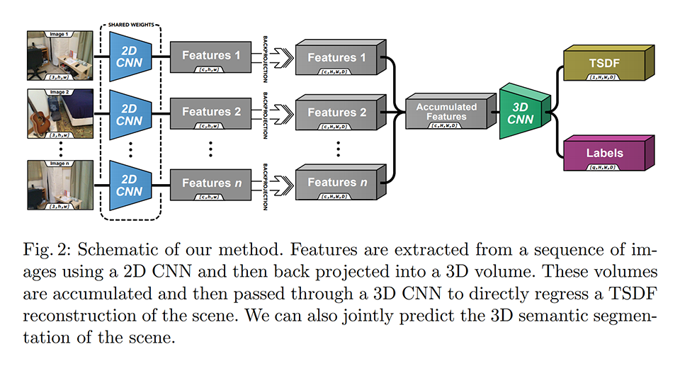
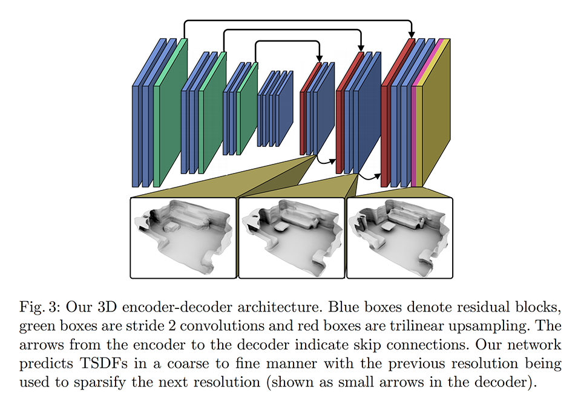
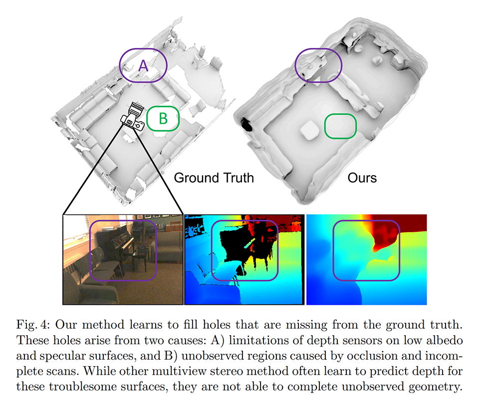
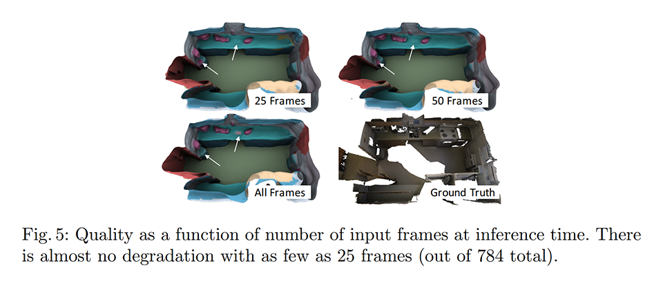
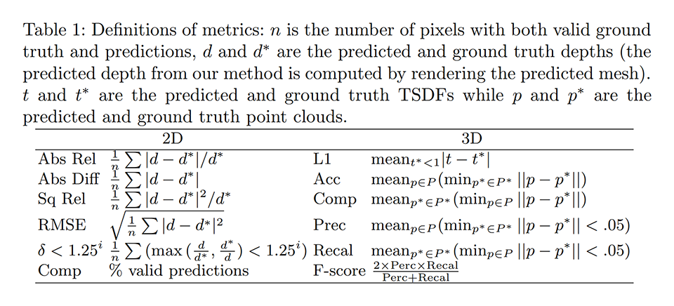
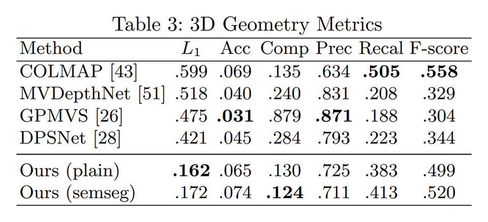
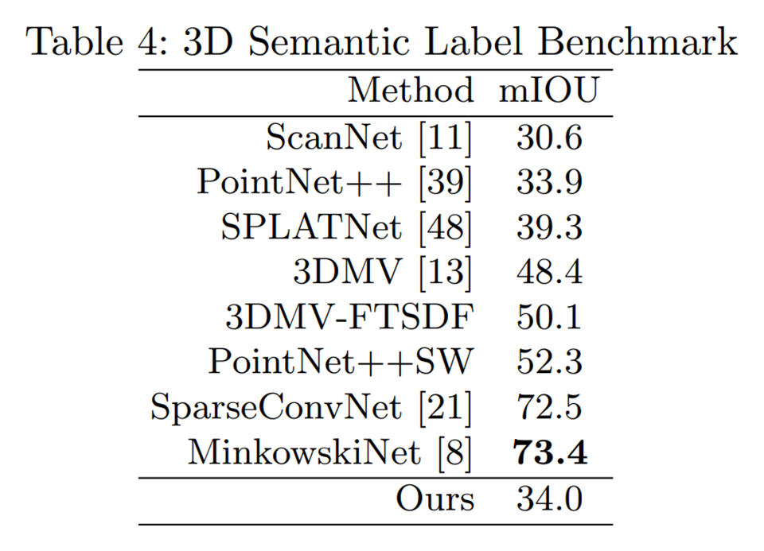
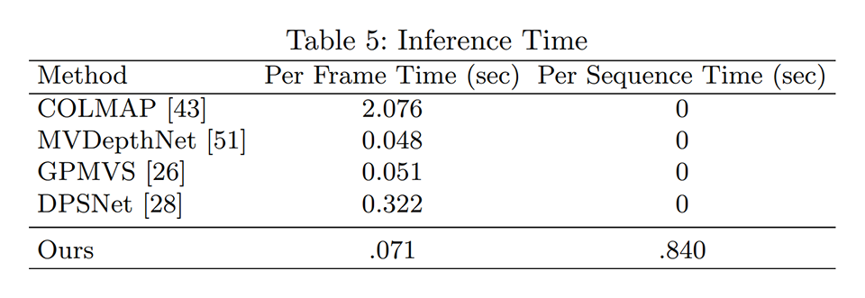

# [\[arxiv\]](https://arxiv.org/abs/2003.10432v2) Atlas: End-to-End 3D Scene Reconstruction from Posed Images

- 著者
    - Zak Murez *1
    - Tarrence van As ∗2 *3
    - James Bartolozzi ∗2
    - Ayan Sinha *1
    - Vijay Badrinarayanan *2 *4
    - Andrew Rabinovich *2 *3
- 所属
    - 1: Magic Leap Inc.
    - 2: Work done at Magic Leap
    - 3: InsideIQ Inc.
    - 4: Wayve.ai

## どんなもの？
### Atlas
姿勢付き画像群から３次元形状（TSDF Volume）と領域ごとの種類（Labeld Mesh）を推定する手法である。

※TSDF とは、最も近い面までの距離を値として持つ Voxel の表現形式の１つである。

## 先行研究と比べてどこがすごい？
- 画像ごとに深度を推定することなく、オクルージョンのケアなどもせずに、３次元形状を直接的に推定できることを示した。
- 未観測領域もいい感じに復元できる。

## 技術や手法の肝は？
Feature Volume（各カメラ画像から得られた特徴量を世界座標系の Voxel へプーリングする手法）を導入することで、素朴な 3D convolution で形状を直接的に推定できるようにした。

Feature Volume を用いると、単独のカメラ画像からは観測できない領域についても、他のカメラ画像から得られた特徴量で復元できるようになる。
不確かな深度をあてにしてオクルージョンを考慮するなどの複雑な処理がい不要となる。

使用するカメラ画像が少なくてもなかなかよい。

## どうやって有効だと検証した？
ScanNet のデータセット（画像数: 2.5M, シーン数: 707）を用いて学習したモデルを、２次元深度と３次元位置に関する評価尺度で比較した。
ついでに処理時間も比較した。

### ２次元深度に関する評価尺度の比較

### ３次元位置に関する評価尺度の比較

※他の手法はカメラ画像の他に深度も入力している。その中で、この精度なら悪くないと主張している。

### 処理時間
DSPNet よりは速い。

## 議論はある？
- ３次元形状復元に関する新しい手法（深度を必要としない手法）を提案した。
- 画像ごとに深度を推定するよりも、３次元形状を直接的に推定する方が、精度がよい。
- 長いフレームシーケンスを効率的に処理できる（時間的に離れたフレームの情報も加味した推論ができる）。
- 未観測領域も上手く推定できる。

## 次に読むべきタイトルは？
- [\[arxiv\]](https://arxiv.org/abs/1912.00036v2) A. Dai, C. Diller, M. Nießner, "Sg-nn: Sparse generative neural networks for selfsupervised scene completion of rgb-d scans", arXiv preprint, 2019.
- [\[arxiv\]](https://arxiv.org/abs/1712.10215v2) A. Dai, D. Ritchie, M. Bokeloh, S. Reed, J. Sturm, M. Nießner, "Scancomplete: Large-scale scene completion and semantic segmentation for 3d scans", ICCV, 2018.
