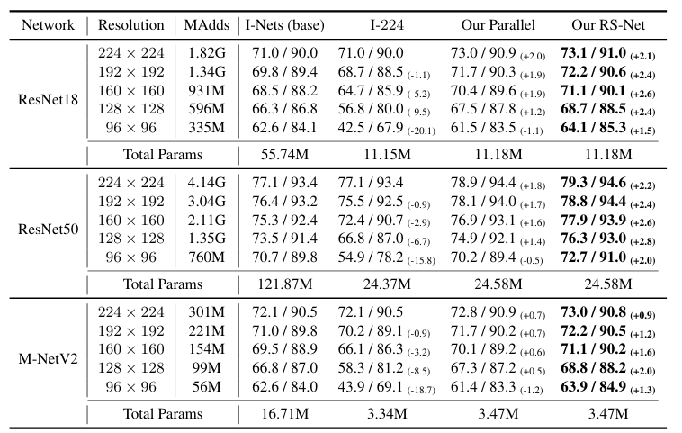
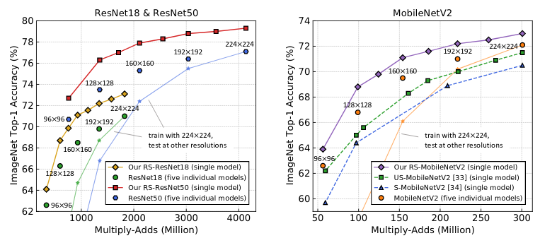

Resolution Switchable Networks for Runtime Efficient Image Recognition
===

Yikai Wang, Fuchun Sun, Duo Li, Anbang Yao

https://arxiv.org/abs/2007.09558

ECCV2020 accepted

@cohama

## どんなもの?

- 画像分類タスクにおいて、1つのモデルで様々な解像度の画像を精度良く解くためのモデルおよび学習方法を提案
  - 通常は 224x224 の解像度で学習したモデルで 96x96 の画像を推論しても精度が出ないが、RS-Net では1つのモデルで 96〜224 までの解像度全てを精度よく分類できる
  - 最終的な精度は解像度別にモデルを作った場合よりも上回る

## 先行研究と比べて何がすごい？

- 1つのモデルで様々な解像度を扱えるモデルは今までになかった

## 技術や手法の肝は？

- 大きく2つ
  - Multi-Resolution Parallel Training
  - Multi-Resolution Ensemble Distillation (MRED)

### Multi-Resolution Parallel Training

- 複数の解像度の画像を同時に学習する
  - 畳み込みの重みは全ての解像度で同じものを共有
  - Batch Normalization だけは解像度ごとに別のパラメータを利用
  - Loss は各解像度での Cross Entropy を合計したもの

### Multi-Resolution Ensemble Distillation (MRED)

- 複数解像度の画像を入力したときのネットワークの出力の分布が近づくように学習を行う
  - 各解像度の画像の出力のアンサンブルを出力させる
    - まず、出力分布の重み付き平均を出す。`α` は学習可能なパラメータ。合計が1になるように Softmax を使う。`z` はロジット (Softmax 層の一個手前の出力)。
    - 
    - `α` の学習には以下の Loss を使う。
    - 
  - アンサンブルした分布を使って、各解像度ごとの分布を KL divergence を計算する
    - 
    - `S`: 解像度の数、インデックス0はアンサンブル、インデックス1は最も解像度の高いもの、以降数字が大きくなると解像度が小さくなっていく
    - 基本、解像度が高いほうが賢いはずなのでインデックス番号が小さい法を教師のように扱う

## どうやって有効だと検証した？

## 議論はある?

- 小さいモデル (ResNet50) でしかやってないのが気になる
- 物体検出とかセグメンテーションとかでも使えると良さそう
  - Appendix にセグメンテーションの例が載っているが、解像度が 352×352 とか小さめの例

## 次に読むべき論文

- Fixing the train-test resolution discrepancy (https://arxiv.org/abs/1906.06423)
