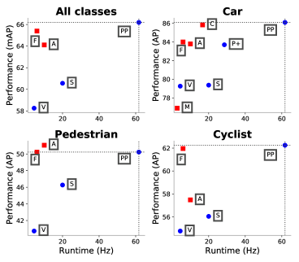
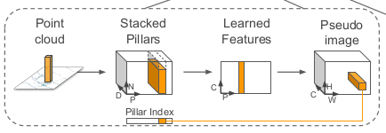
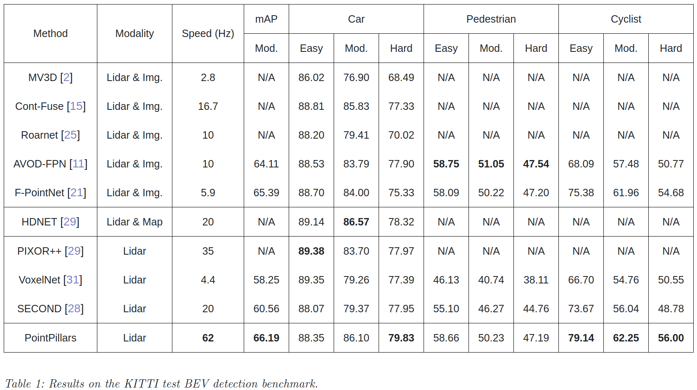

# PointPillars: Fast Encoders for Object Detection from Point Clouds
[https://arxiv.org/abs/1812.05784](https://arxiv.org/abs/1812.05784)
[https://tech.tier4.jp/entry/2019/04/25/185724](https://tech.tier4.jp/entry/2019/04/25/185724)
[https://qiita.com/chin_self_driving_car/items/362772f5078c0cbe4c0d](https://qiita.com/chin_self_driving_car/items/362772f5078c0cbe4c0d)

（まとめ @usako_tail）

著者
* Alex H. Lang
* Sourabh Vora
* Holger Caesar
* Lubing Zhou
* Jiong YangOscar Beijbom  
nuTonomy: 自動運転車や自律移動ロボット用のソフトウェアベンチャーの会社の人

# どんなもの？

* 3D点群を使って物体検出（画像はfusionしない）
* 点群を柱に見立てる
* 早くてかしこい

# 先行研究と比べてどこがすごい？

## 鳥瞰点群
点群を上から見た状態の2Dとして捉える方法、スケールの曖昧さがなく、オクルージョンがほとんどないなど、いくつかの利点があるが、画像と違い点群は疎なので単純に畳み込みするのでは上手くいかない問題がある

## VoxelNet
空間をボクセルに分割し、各ボクセルにPointNetを適用し、続いて3D畳み込み中間層で垂直軸を統合した後、2D畳み込み検出アーキテクチャを適用する手法
検出性能は良いが、4.4fpsとリアルタイムは無理な速度

対してpointpillarsは空間をボクセルに分割するのではなく、柱状に分割することで62fpsと高速化
また、高さ方向の区切りの設定が不要

# 技術や手法の肝は？

3つの部品で構成
1. 点群を疎な疑似画像に変換する特徴エンコーダネットワーク
2. 疑似画像を高レベル表現に処理する2D畳み込みバックボーン
3. 検出と3Dボックスの回帰を行う検出ヘッド

## 特徴エンコーダネットワーク

通常の点（x,y,z,r: 点の位置と、反射強度の値）

に加えて、xy平面上をpillar, Pで分割し

xc, yc, zc: pillar内のすべての点の座標の平均からの距離  

xp, yp: pillar中心からのオフセット

を追加した9次元を1点に割り当てる（D）

D：点が保有する次元数（9）

P：点の存在するpillarの数

N：pillarに存在する点の数

を合わせた（D,P,N）をpointnetに掛ける→（C,P,N）

C：PointNet出力の全結合層のレイヤ数に依存する  

出力された（C,P,N）をpseudo-imageに変換する→（C,H,W）

（H,W）：鳥瞰視点でみたキャンバスサイズ

画像と同じような形式にすることでその後の畳込みに使うことができる

## 2D畳み込みバックボーン

畳み込みを行い各層から特徴抽出
→upsampling + concatする

（C,H,W）のpseudo-imageを、(6C, H/2, W/2)のtensorに変換する

## 検出ヘッド

通常の2Dでの矩形検出 + クラス分類、物体の位置と高さを推論する
## その他
### Loss
位置（x,y,z,w）,クラス（l）,向き（θ）
をlossとして使う
### 柱
xy分解能は0.16m，柱の最大数(P)は12000，柱あたりの最大ポイント数(N)は100
### アンカー
各クラスのアンカーは幅、長さ、高さ、z中心で設定、
0度と90度の2つの方向をもたせたもの

アンカー：(x,y,z,w,l,h,θ)

# どうやって有効だと検証した？

##  KITTIベンチマーク
鳥瞰図

3D

鳥瞰図2Dと3Dの両方で一部を除き高い精度を出した
速度としても高速化

方向については平均配向類似性（AOS）検出ベンチマークを使用

上記の中で3D検出が可能であるのはAVOD-FPN、SECOND、PointPillarsのみ

# 次に読むべき論文は？

