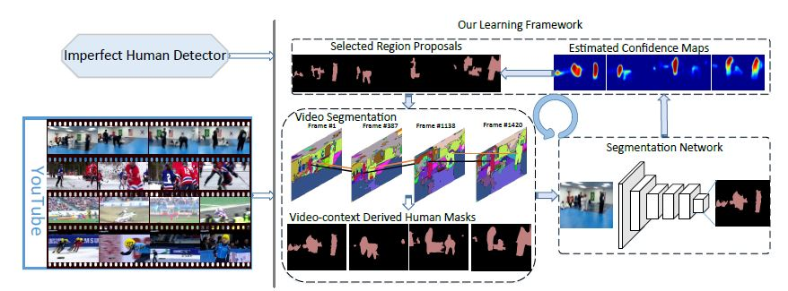
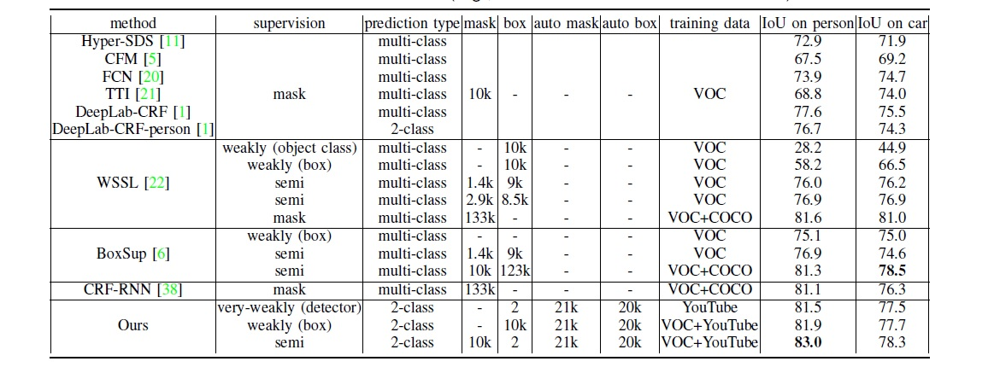
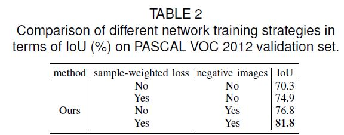

# Learning to Segment Human by Watching YouTube

https://arxiv.org/pdf/1710.01457.pdf
（まとめ 熊Bill）
著者　Xiaodan Liang, Yunchao Wei, Liang Lin, Yunpeng Chen, Xiaohui Shen, Jianchao Yang, Shuicheng Yan

# どんなもの？

- 人間検知について、まずキーフレームを決めて、ImperfectHuman DetectorでSuperPixelのリージョンを決める
- 次はビデオのフレームと比べて、色分けてSuperPixelのグラフを作る
- このSuperPixelグラフを使って、またSuperPixelのリージョンを更新する
# 先行研究と比べてどこがすごい？

今までの手法と比べて、精度が上回る

# 技術や手法の肝は？
- グラフを作るとき、見た目(appearance)、ラベルの内容、場所を比較して、グラフを作ります。
- 2万個のYouTubeビデオクリップをイメージ化して、学習した。1枚イメージは2秒がかかりそうです。
- 10 Iternation, 毎IternationはNVIDIA Teslaで二日がかかりそうです。

# どうやって有効だと検証した？
- Pascal VOCデータセット（4500+枚写真のデータセット)にベンチマークした。

# 次に読むべき論文は？
最後のこのノートに気になる
「This work was in part supported by State Key Development
Program under Grant NO. 2016YFB1001000 and sponsored
by CCF-Tencent Open Fund.」