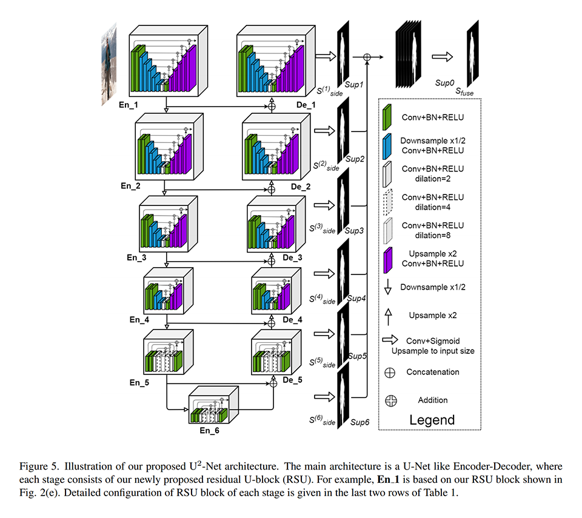
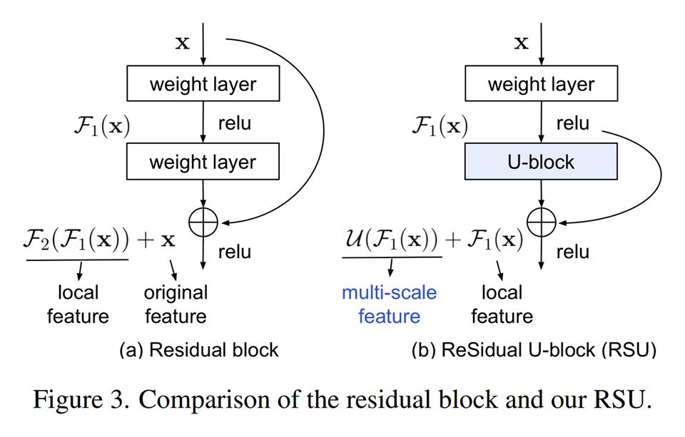
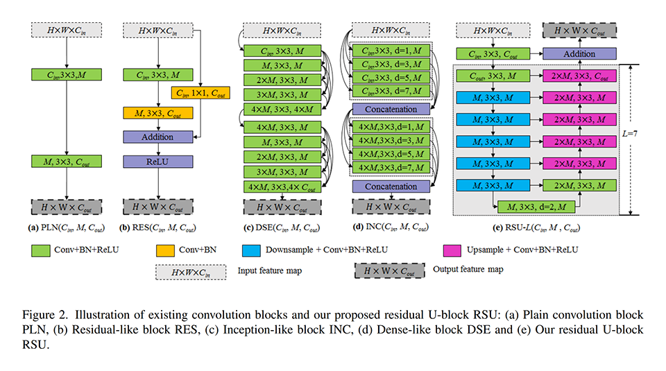
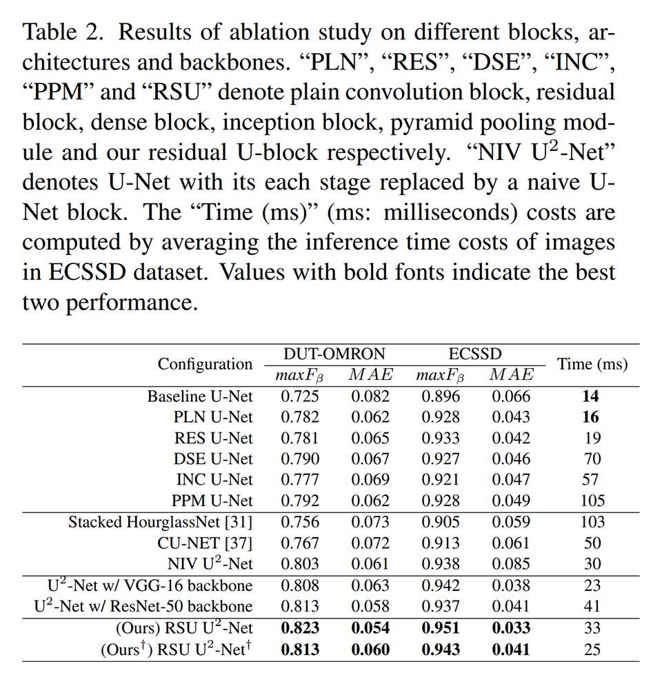
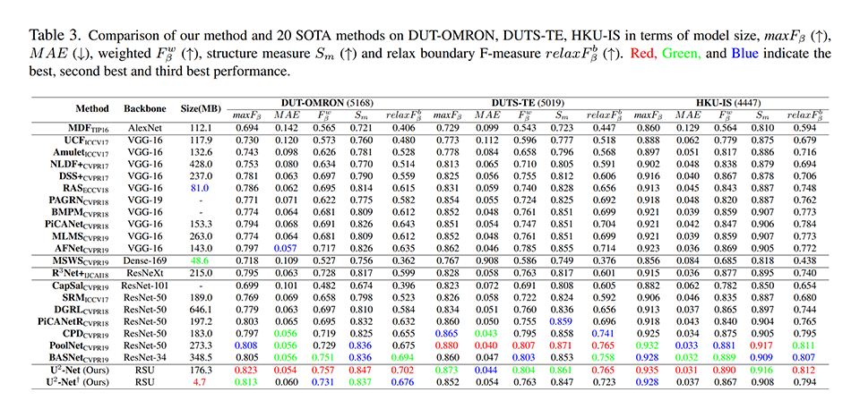
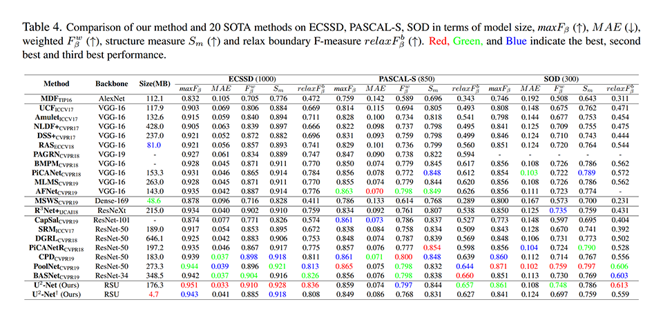
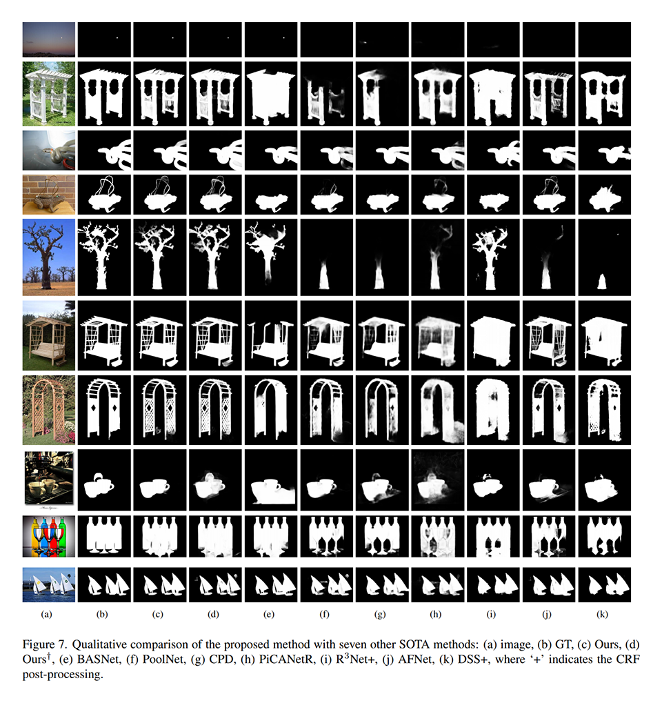

# [\[arxiv\]](https://arxiv.org/abs/2005.09007v2) U^2-Net: Going Deeper with Nested U-Structure for Salient Object Detection

- 著者
    - Xuebin Qin *1
    - Zichen Zhang *1
    - Chenyang Huang *1
    - Masood Dehghan *1
    - Osmar R. Zaiane *1
    - Martin Jagersand *1
- 所属
    - 1: University of Alberta, Canada

## どんなもの？
### U^2-Net
U-Net をネストして２階層にしたアーキテクチャである。

### 資料
- [ソースコード](https://github.com/NathanUA/U-2-Net)

## 先行研究と比べてどこがすごい？
- 既存手法より少ないパラメータ数で既存手法を上回る精度を実現している。
    - U^2-Net: 176.3MB, 30FPS on GTX 1080Ti
    - U^2-Net (軽量版): 4.7MB, 40FPS on GTX 1080Ti

## 技術や手法の肝は？
### U^2-Net
U-Net の各スケールのフィーチャーマップ生成部分を RSU block（U-Net を ResNet 風にアレンジしたもの）に置き換えることで、効率的に深さを確保しつつ、様々なスケールの特徴を捉えられるようにしている。

### RSU block (ReSidual U-block)

## どうやって有効だと検証した？

### アーキテクチャの比較
次のデータセットで学習・評価し、各手法を比較することで、アーキテクチャに関する知見を得た。

- U-Net のフィーチャーマップ生成部分は U-Net にした方がよい（既存手法より NIV U-2-Net がよい）。
- 単に U-Net をネストするより、ResNet 風にしてネストした方がよい（NIV U^2-Net より RSU U^2-Net の方がよい）。

- 学習用データセット
    - DUTS-TR: 10553 枚
        - DUTS データセット（よく訓練に使われる巨大な画像データセット）の一部
- 評価用データセット
    - DUT-OMRON: 5168 枚
        - １枚に１～２個の構造的に複雑な物体が写っているデータセット
    - ECSSD: 1000 枚
        - 構造的に複雑でしばしば大きなオブジェクトが写っているデータセット

### 既存手法との比較
次のデータセットで学習・評価し、各手法を比較することで、提案手法が既存手法より少ないパラメータ数で同等以上の精度を達成することを確認した。

- 学習用データセット
    - DUTS-TR: 10553 枚
        - DUTS データセット（よく訓練に使われる巨大な画像データセット）の一部
- 評価用データセット
    - DUT-OMRON: 5168 枚
        - １枚に１～２個の構造的に複雑な物体が写っているデータセット
    - DUTS-TE: 5019 枚
        - DUTS データセットの一部
    - HKU-IS: 4447 枚
        - １枚に複数のオブジェクトが写っているデータセット
    - ECSSD: 1000 枚
        - 構造的に複雑でしばしば大きなオブジェクトが写っているデータセット
    - PASCAL-S: 850 枚
        - 複雑な物体や雑然とした背景が写っているデータセット
    - SOD: 300 枚
        - 枚数は少ないが挑戦的なデータセット

定性的にも提案手法がより正確な出力をしていることが確認できる。

## 議論はある？
- U^2-Net（ネストした U-Net）と RSU block（U-Net を ResNet 風にアレンジしたもの）は高精度化・高速化を両立するためのよいアーキテクチャである。
- 高精度化と高速化を追求するにはより大きく多様なデータセットが必要になる。

### 私見
- 次の組み合わせれば更に高精度にできそうな気がする。
    - PackNet のアイデア: space2depth・depth2space・滑らかな活性化関数を用いた情報劣化のないアーキテクチャ
    - Eff U-Net のアイデア: EfficientNet のハイパーパラメータ探索方法
- RSU block の最初の畳み込みは入出力のチャネル数を合わせるためにやっているのだろうが、恐らく入れない方がよい（できるだけ入力を触らずにパススルーする方が、単純な概念を優先して獲得しやすくなるため繁華精度が高くなりやすいため）。

## 次に読むべきタイトルは？

### PoolNet
- [\[arxiv\]](https://arxiv.org/abs/1904.09569v1) J. Liu, Q. Hou, M. Cheng, J. Feng, J. Jiang, "A simple pooling-based design for realtime salient object detection", CVPR, 2019.
