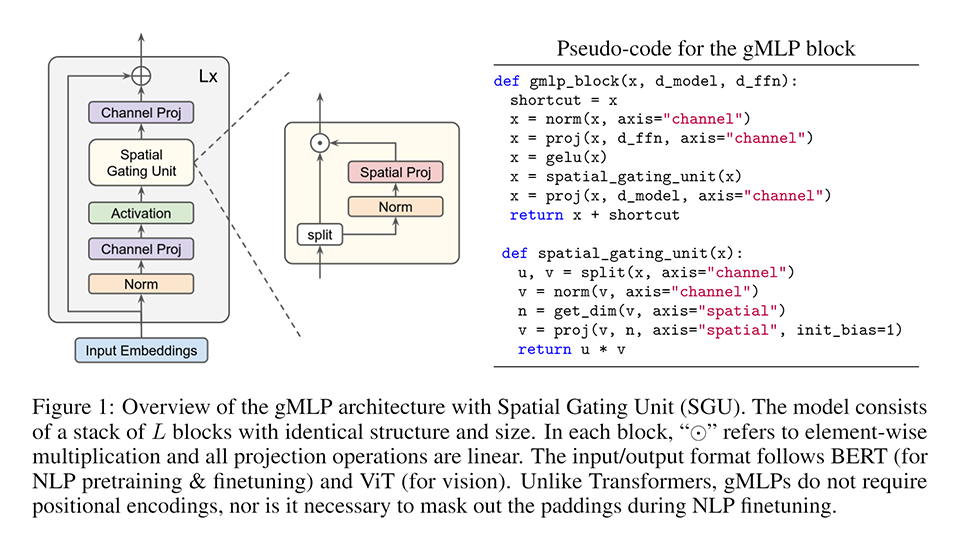

# [\[arxiv\]](https://arxiv.org/abs/2105.08050v1) Pay Attention to MLPs

- 著者
    - Hanxiao Liu *1
    - Zihang Dai *1
    - David R. So *1
    - Quoc V. Le *1
- 所属
    - 1: Google Research, Brain Team

## どんなもの？
### gMLP (Gated Multi Layer Perceptron?)
- Transformer をゲート付き MLP で単純化したアーキテクチャである（位置情報の埋め込みもない）。
- gMLP は Transformer と同様にモデルサイズを大きくする性能改善が効く。

## 先行研究と比べてどこがすごい？
- MLP-Mixer では Transformer の性能に及ばなかったが、gMLP は Transformer と同等の性能である。
- Transformer にとってコンテンツ間インタラクションが本質的に重要ではないことを示した。

## 技術や手法の肝は？
### gMLP (Gated Multi Layer Perceptron?)
- gMLP は単純な MLP でチャネル方向の情報に２回ミックスし、その途中でゲートを通過させる。ゲートを通過させる際に、空間方向の情報をミックスし、その結果をマスクしている。
    - MLP-Mixer は空間方向とチャネル方向の情報のミックスを交互に行う手法で gMLP に近い。MLP-Mixer では性能を高めるために位置情報の埋め込みが必要だったが、gMLP はゲートで置き換えた。
    - Transformer は入力をマスクする（各位置のコンテンツが周辺のどのコンテンツと関係が深いかを求めて、それを使って周辺コンテンツを集約する）手法であるため計算量が大きいが、gMLP は出力をマスクする（周辺のコンテンツの情報を集約した結果の重要性でマスクする）手法であるため計算量が小さい。

## どうやって有効だと検証した？

### ImageNet での性能比較

## 議論はある？
- とくになし

### 私見
- 論文ではアテンションフリーにできたと主張しているが、ゲート（どの位置の情報を重視するかを表す重み）はアテンションなので表現が適切ではない。コンテンツ間インタラクションが不要と言った方が適切である。

## 次に読むべきタイトルは？

### MLP-Mixer
[\[arxiv\]](https://arxiv.org/abs/2105.01601) I. Tolstikhin, N. Houlsby, A. Kolesnikov, L. Beyer, X. Zhai, T. Un-terthiner, J. Yung, D. Keysers, J. Uszkoreit, M. Lucic, A. Dosovitskiy, "Mlp-mixer: An all-mlp architecture for vision", arxiv preprint, 2021.
