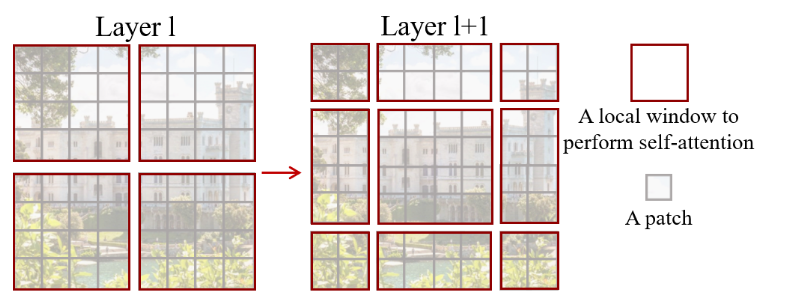
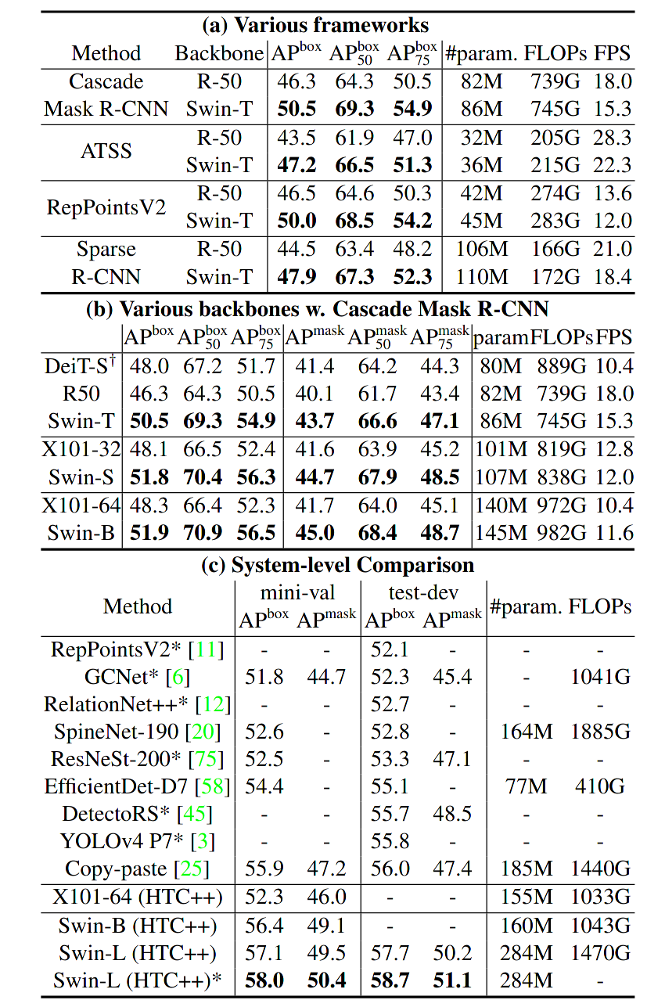

Swin Transformer: Hierarchical Vision Transformer using Shifted Windows
===
Ze Liu, Yutong Lin, Yue Cao, Han Hu, Yixuan Wei, Zheng Zhang, Stephen Lin, Baining Guo

(Microsoft Research ASIA)

https://arxiv.org/abs/2103.14030v1

@cohama

## どんなもの?

- Transformer を使った、画像系タスクに汎用的に使えるバックボーンを提案
  - 他の Transformer 系や CNN に比べてより良い精度-速度のトレードオフを達成 (※ 論文執筆時点 2021/03 で)

## 先行研究と比べて何がすごい

- ViT は JFT-300M のような巨大なデータセットでの事前学習が必要だが、提案手法は不要
  - ただし、これは DeiT という研究で既に達成されている
- ViT 解像度の粗い特徴マップしか作れず、また、解像度を上げるのが難しい (2乗オーダーで計算量が増える)。結果的に物体検出やセグメンテーションなどのバックボーンに利用できない。提案手法はその点を改善している。

## 技術や手法の肝は？

- ViT のように画像をパッチに分けてトークンにする点は一緒。Attention を取る部分を固定のサイズのウィンドウ内でのみに限定する
- CNN のように特徴マップの解像度をブロックごとに1/2していくアーキテクチャにする。チャネル数も倍々に増やしていく。

- これだけだとウィンドウ間の関連がなくなってしまう。これを改善するためにある層の次の層ではウィンドウのとり方をそのサイズの半分だけずらすようにする。

## どうやって有効だと検証した？

### ImageNet

### 物体検出 (COCO)

## 議論はある?

- Transformer 系でまだまだ改善の余地があるなと思わせる論文
- 現時点だと EfficientNetV2 が出てきたのでまだ CNN が強い

## 次に読むべき論文

- ViT: Transformer を使って画像分類するやつ。
  - An Image is Worth 16x16 Words: Transformers for Image Recognition at Scale (https://openreview.net/forum?id=YicbFdNTTy)
- DeiT: ViT は大量の画像が事前学習に必要だがそれを不要にするような学習方法を提案
  - Training data-efficient image transformers & distillation through attention (DeiT) https://arxiv.org/abs/2012.12877
