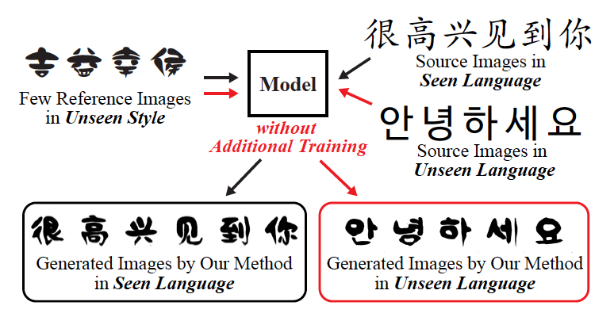
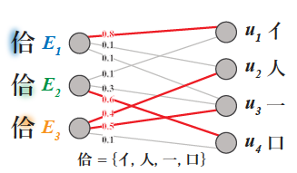
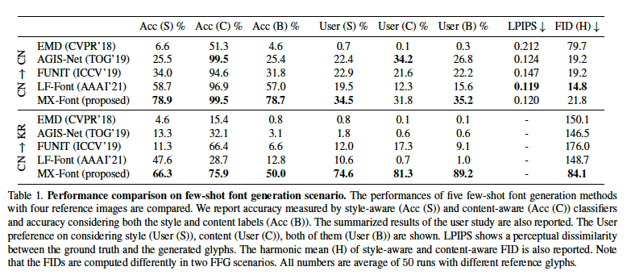
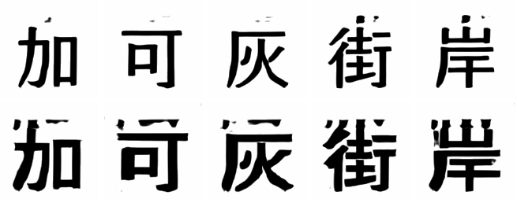

# Multiple Heads are Better than One: Few-shot Font Generation with Multiple Localized Experts

[https://arxiv.org/abs/2104.00887](https://arxiv.org/abs/2104.00887)

（まとめ @derwind）

- 著者
    - Song Park *1
    - Sanghyuk Chun *2, 3
    - Junbum Cha *3
    - Bado Lee *3
    - Hyunjung Shim *1
- 所属
    - 1: School of Integrated Technology, Yonsei University
    - 2: NAVER AI Lab
    - 3: NAVER CLOVA 

## どんなもの？

- 敵対的生成ネットワーク (GAN) による文字の生成である。
- 推論時には、コンテンツ（≒字体）のベースとなる「ソース文字」の画像の他に、スタイル（≒デザイン）のベースとなる数文字の「参照文字」を与えることで、「参照文字」のデザインに近い沢山の文字を生成できる。
- 細部の形状もわりと高い精度で再現できる。
- ある言語（例えば中国語）のフォントのデザインに近しい別の言語（例えば韓国語）フォントなど、クロスリンガルな文字生成もできる。

 [arxiv_2104.00887.md](arxiv_2104.00887.md) 

## 先行研究と比べてどこがすごい？

- 推論時の用いるスタイル用の参照文字が少なくて済む。
- 細部の形状を極力保持し、潰れやパーツの欠損も少ない。
- 特定の言語に特化しすぎない手法である。（よって、中国語のフォントのデザインを韓国語のフォントのデザインに反映できたりする）

## 技術や手法の肝は？

- 文字をただの絵として見るのではなく、文字構造としてコンテンツとスタイルという特徴を分離することで、スタイル部分の特徴を入れ換えることでデザインを変更することができる。
- 「エキスパート」と呼ばれるエンコーダに文字を構成する部品の情報を抽出させる。
    - 論文のサンプルである「佮」という字を例にとると、「亻」「人」「一」「口」に分解できるので、4 つの「エキスパート」が個別に情報を抽出することで、細部の詳細を保った文字生成ができる。 
- 「エキスパート」は文字の特定の部品、例えば「人」や「口」に明示的マッピングするような方法は用いておらず、部品に自動的に割り当たるようなアルゴリズムを採用している。

- 以下のようにこの系統の研究には推論時に「全体的なスタイルを丸ごと使う方法」「参照文字を構成する部品ごとに部品ラベルも一緒に与えて細部情報を保持する方法」「参照文字にエキスパートを自動で割り当てさせて細部情報を保持させる方法」があり、本論文では 3 つめの方法になる。

## どうやって有効だと検証した？

- [定量的評価] 分類器による分類性能とユーザー調査。観点はスタイルの観点 (S), コンテンツの観点 (C), 両方の観点 (B) からなる。
    - ResNet-50 ベースの「スタイル分類器」「漢字分類器」「ハングル分類器」を訓練してそれらを使って提案手法と既存手法の分類性能を見る: Acc (S), Acc (C), Acc (B), 
    - ユーザー調査を行い、スタイルの観点およびコンテンツの観点から提案手法と既存手法の生成画像のうち最も好ましいものを 3 つ選んでもらい手法の優劣を見る: User (S), User (C), User (B)
- [定量的評価] GT と生成画像の類似度の測定: LPIPS スコア, FID（フレシェ開始距離）

- [定性的評価] 幾つかの文字をサンプルで生成して目視で各手法が苦手なケースなどを確認する。

---

## 議論はある？

- エキスパートの個数は少なすぎても無闇に増やしても良くないとのこと 6 つが最適らしい。これは漢字を部品に分解した時におおよそ 6 個までのケースが多く、それ以上エキスパートを用意してもうまく学習できないためと著者らは推測している。
- 数値的な良し悪しと人間にとっての見た目の良し悪しが必ずしも一致しない。例えば FID が少し悪くなるケースでも見た目は悪くない場合もある様子。著者らの見解としてはユーザーの好みが分かるユーザー調査のほうが信頼できる傾向にあるとのこと。

## 次に読むべき論文は？

- [Few-shot Font Generation with Localized Style Representations and Factorization](https://arxiv.org/abs/2009.11042)
    - 既存研究のうち「参照文字を構成する部品ごとに部品ラベルも一緒に与えて細部情報を保持する方法」に相当するもの。著者らの 1 つ前の研究。2 段階で訓練する手法であるので実施にはちょっと手間がかかるが内容は興味深い。

## おまけ

[オフィシャルコード](https://github.com/clovaai/mxfont) が存在するので、Google Fonts を用いて Tesla T4 環境で実際に 2 日間程度訓練して推論させてみた。

### 10000 ステップ時の Validation

モード崩壊のような絵が出ているので不安になるが、そのうち解消する様子。

### 60000 ステップ時の Validation

20000 ステップ目くらいには結構まともな絵が出ていた。それ以降は少しずつ変化する感じ。

### 60000 ステップ程度訓練したモデルでの推論

オフィシャルコードに付属していたサンプルフォントを使って、スタイルの学習に使う文字を 4 文字で推論させてみた。

