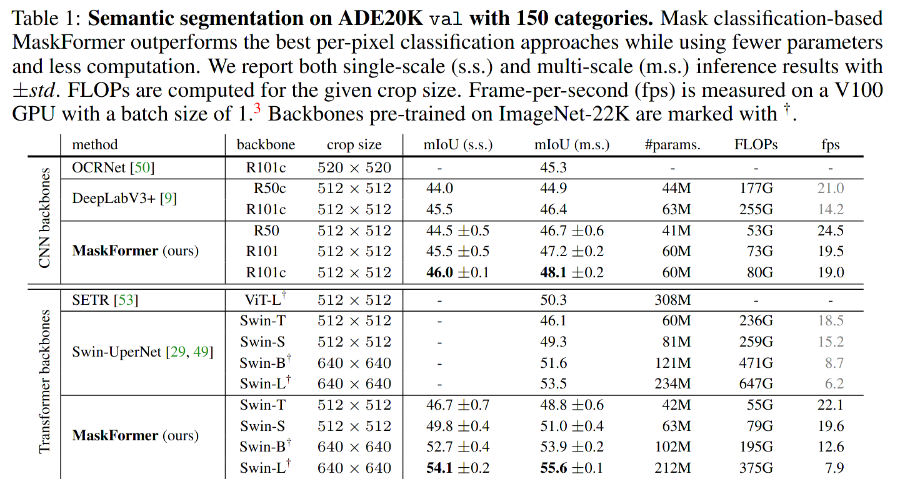
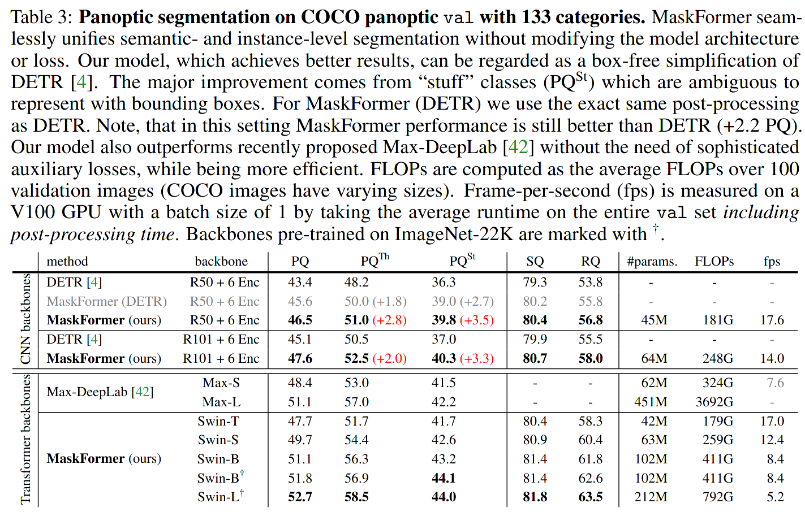
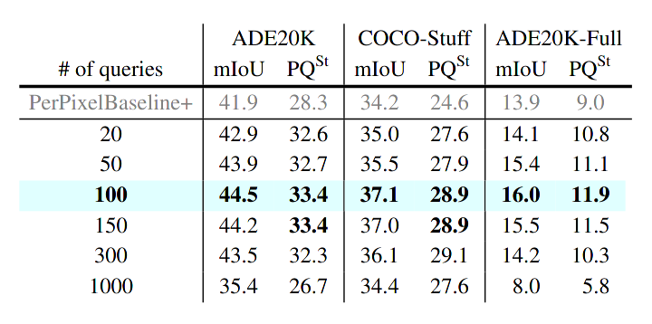

Per-Pixel Classification is Not All You Need for Semantic Segmentation
===

- Bowen Cheng (Facebook AI Research)
- Alexander G. Schwing
- Alexander Kirillov (Facebook AI Research)

https://arxiv.org/abs/2107.06278v1

@cohama

## どんなもの?

- Transformer を使った、画像セグメンテーション手法
  - FCN のようにピクセルごとにクラスを割り当てる手法 (per-pixel) ではなく、Mask R-CNN のように物体かどうかの2値のマスクとそれに紐づくクラス分類を N 回行い、その結果を統合することでセマンティックセグメンテーションやパノプティックセグメンテーションを行う。
- ADE20K と COCO の panoptic セグメンテーションで SOTA 達成

## 先行研究と比べて何がすごい

- 従来の FCN 系は per-pix で分類を行う手法だったが提案手法は Mask 分類という異なる手法でセグメンテーションを実現している。
- Mask 分類自体は Mask-RCNN や DETR など以前からあったものだが instance-discrimination loss や mask-id loss など複雑な Loss の設計が必要。

## 技術や手法の肝は？

### (per-pixel 分類に対する) Mask 分類の定式化

- per-pixel 分類では各ピクセルごとに K (=クラス数) 個のベクトルを推定する。訓練時には各ピクセルで教師とのクロスエントロピーを計算する。
- Mask 分類では以下のことを行う。
  1. 画像を N この領域に分割する。(N と K は必ずしも等しくない)
  2. 領域ごとに、物体かどうかの2値マスクと K+1 クラスの分類を行う。すなわち、確率 p とマスク m のペア z が N 個集まったものが出力となる。また物体ではないというクラスを表すため K ではなく K+1 になっている。
  3. 訓練時には教師とのマッチングを行う。損失関数として、マスクのピクセルごとの2値分類と K 個のクラス分類の損失関数を足し合わせる。

- p: 分類の出力
- c: クラス分類の教師
- m: マスク

### MaskFormer のアーキテクチャ

- 全体は3つの構成要素からなる。
  1. pixel-level モジュール: ピクセルごとの埋め込みを計算する。この結果はマスクの出力に用いる
    - 一般的な CNN ベースのセグメンテーションと同様なエンコーダデコーダ構造をしている。最終的に `Cε x H x W` の埋め込み `ε_pixel` を出力する。
  2. transformer モジュール: 名前の通り Transformer からなる。`CQ x N` の埋め込み `Q` を出力する。
    - pixel-level モジュールのエンコーダの出力から先に接続。そこから一般的な Transformer のデコーダ部分をつなげる。画像の特徴マップと N 個のクエリを入力にとる。
  3. segmentation モジュール: 各埋込みから分類の確率とマスクのペアを N 個出力する。
    - まず、`Q` から出力が softmax であるネットワークを通じて N 個の K+1 クラス分類の確率を出力する。K クラスに no-object のクラスを追加している。
    - 次に、N 個のマスクを計算する。transformer の出力に対して2層の MLP を通して `Cε x N` のマスク埋め込み (`ε_mask`) に変換する。`ε_pixel` と `ε_mask` のドット積 (行列積) + sigmoid をとることで最終的なマスクを得る。
- per-pixel なセグメンテーションだと softmax を使う (マルチクラスに相当) のでクラス間の予測が排他的になるが、そうではなく N 個の2値出力を使う (マルチラベルに相当) 方が経験的に有益だと筆者らは述べている。
- 訓練時のマスクの損失関数には DETR と同様に、focal loss と dice loss を合成したものを用いる。

### 推論時

- 推論時に確率とマスクのペアからセグメンテーションの結果に変換する必要がある。
  - ある位置 (h, w) のセグメンテーション結果は以下のような式で算出する。
  - 
  - 
  - 要は、マスクの出力の大きさで重み付けしたクラス分類
  - False Positive を減らすため、マスクの大きさにある程度しきい値を設ける (mi > 0.5)
  - N 個ある出力を区別すればインスタンスセグメンテーション (またはパノプティックセグメンテーションも?) に、同じクラスを持つものを統合すればセマンティックセグメンテーションになる。
- セマンティックセグメンテーションの場合は以下のような式にしたほうが性能が良い。
  - 

## どうやって有効だと検証した？

セマンティックセグメンテーションとパノプティックセグメンテーションのタスクで SOTA な性能になることを示した。

### セマンティックセグメンテーションの結果

### パノプティックセグメンテーション

### Ablation
#### マスク分類の効果

- per-pixel によるセグメンテーションとマスク分類によるセグメンテーションの結果の比較を行った。
- PerPixelBaseline は単純に FCN と同様のアーキテクチャ。
- PerPixelBaseline+ は Transformer を追加しただけ

#### クエリの数 N

## 議論はある?

- やはり N の設定が難しそう
- パラメータ数でみると巨大モデルではないが、1枚の画像の出力が N 倍になって出力されるのでメモリ使用量がやばそう
  - > All models are trained with 8 V100 GPUs.
  - バッチサイズ32、640x640の解像度で訓練しているらしい。1GPU あたりバッチサイズ4くらいが限界か

## 次に読むべき論文

- ViT: Transformer を使って画像分類するやつ。
  - An Image is Worth 16x16 Words: Transformers for Image Recognition at Scale (https://openreview.net/forum?id=YicbFdNTTy)
- SETR: Transformer を使ってセグメンテーションするやつ。
  - Rethinking Semantic Segmentation from a Sequence-to-Sequence Perspective with Transformers (https://arxiv.org/abs/2012.15840)
- DETR: Transformer を使って物体検出
  - End-to-End Object Detection with Transformers (https://arxiv.org/abs/2005.12872)
- Swin Transformer: 画像系タスク用にチューニングした Transformer
  - Swin Transformer: Hierarchical Vision Transformer using Shifted Windows (https://arxiv.org/abs/2103.14030v1)
