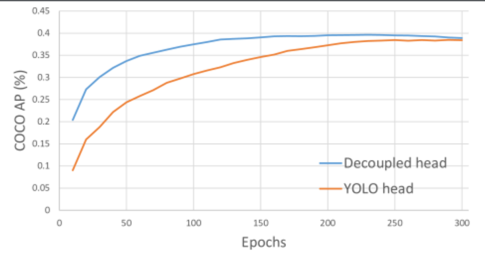
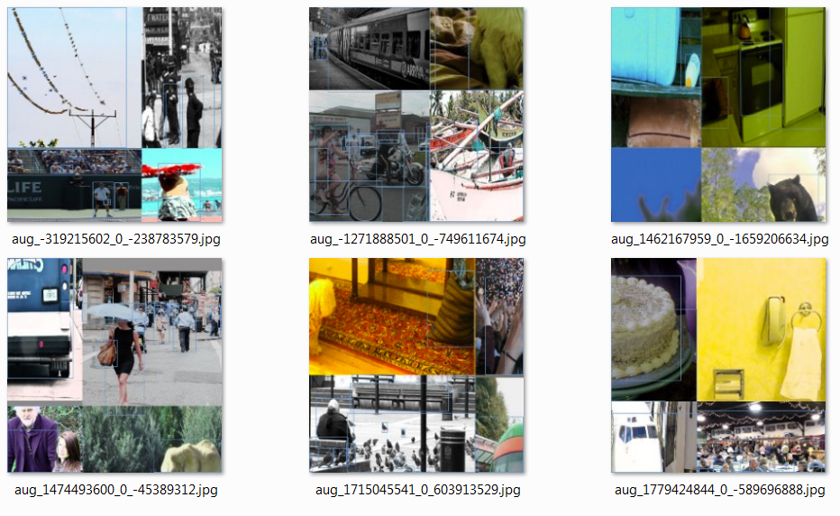
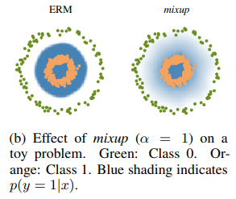

# YOLOX: Exceeding YOLO Series in 2021
[https://arxiv.org/abs/2107.08430](https://arxiv.org/abs/2107.08430)
[https://ichi.pro/cvpr-2021-papersummary-yolox-2021-nen-ni-yolo-shiri-zu-o-koeru-217987602297340](https://ichi.pro/cvpr-2021-papersummary-yolox-2021-nen-ni-yolo-shiri-zu-o-koeru-217987602297340)
[https://medium.com/@tastekinalperenn/yolox-main-idea-behind-latest-yolo-algorithm-5f8aa930c33c](https://medium.com/@tastekinalperenn/yolox-main-idea-behind-latest-yolo-algorithm-5f8aa930c33c)

（まとめ @usako_tail）

著者
* Zheng Ge
* Songtao Liu
* Feng Wang
* Zeming Li
* Jian Sun

# どんなもの？

YOLOシリーズ最新作
* YOLOv3をアンカーフリーに
* 分離ヘッドや最先端のラベル割り当て戦略SimOTAなどを導入
* 早くてかしこい(Tesla V100で68.9FPS、YOLOv5-Lを1.8%AP上回る)

# 先行研究と比べてどこがすごい？

## YOLOv3 
YOLOXはYOLOv3をベースに構築されている（v4,v5はアンカー有りの設定に依存しすぎているとのこと）
YOLOX-XでAP51.2%、ベースになっているYOLOv3と比べると7.3%向上した

# 技術や手法の肝は？

1. 分離ヘッド
2. アンカーフリー
3. データオーグメンテーション（Mosaic・MixUp）

## 分離ヘッド

yolov3で使用されている一体型ヘッドでは、分類および回帰タスク間の競合が起きることがわかっている
このヘッド部分を分離することで学習の収束速度が大幅に向上した

## アンカーフリー

アンカー有りの場合、同じ位置で複数の物体を検出することができるが、以下の欠点があった

 * 検出精度を高めるためには、トレーニングの前にクラスタリング分析をして最適なアンカーを決める必要がある
   * このアンカーの分布はデータセット固有のものになってしまう
 * アンカー有りの場合、検出部が複雑になること、また各画像の予測数が膨大になり検出が遅くなる原因になっていた

各場所の予測を3から1に減らし、グリッドの左上隅に関する2つのオフセットと予測されたボックスの高さと幅を直接予測するようにした
これによって検出器のパラメータが減少して高速化した

## データオーグメンテーション（Mosaic・MixUp）
### Mosaic
4つの画像を混ぜるオーグメント

初出はYOLOv4[https://arxiv.org/abs/2004.10934](https://arxiv.org/abs/2004.10934)

### MixUp
2つの画像を重ね合わせてそれぞれの画像の透過度によってラベルを決定するというオーグメント

[https://arxiv.org/abs/1710.09412](https://arxiv.org/abs/1710.09412)

判別面が滑らかになることによって汎化性能が上がるとのこと

# どうやって有効だと検証した？

## これまでのSOTAとの比較

最高性能のYOLOX-XではAP51.2%,FPS57.8
性能が下がるYOLOX-DarkNet53ではAP47.4％だが、FPS90.1

# 次に読むべき論文は？

???
