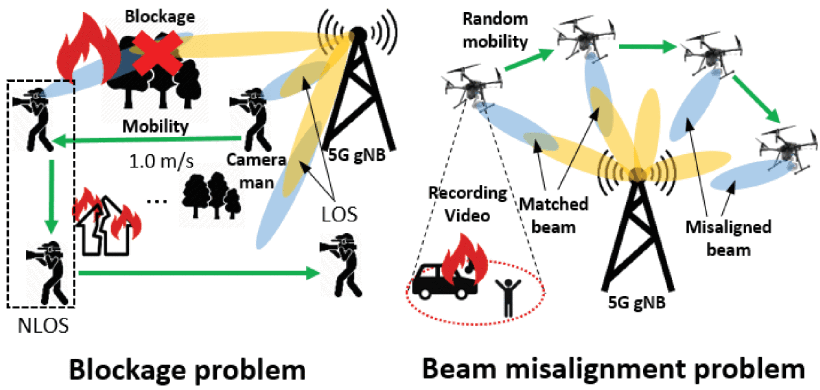
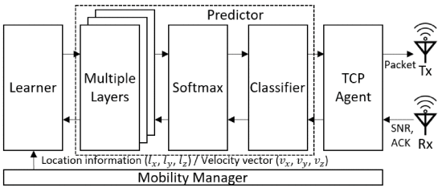
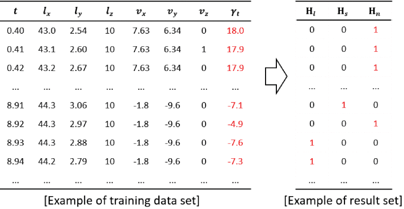
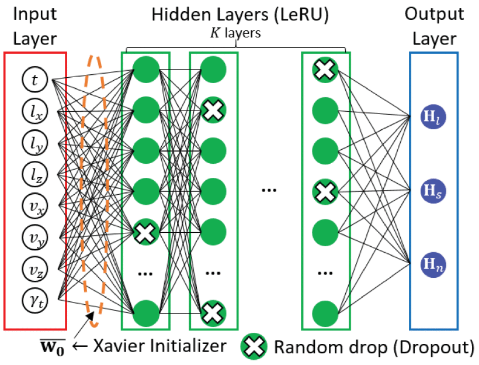
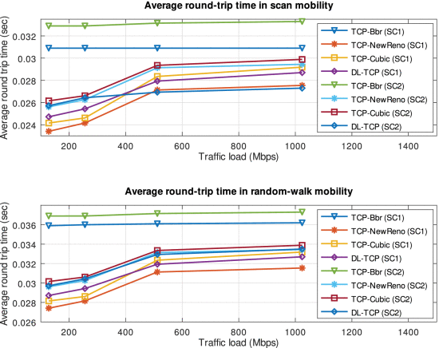

DL-TCP: Deep Learning-Based Transmission Control Protocol for Disaster 5G mmWave Networks
===

2019/10/04 Woongsoo Na; Byungjun Bae; Sukhee Cho; Nayeon Kim

https://ieeexplore.ieee.org/abstract/document/8859212

（まとめ：yuji38kwmt）

---

## どんなもの？
* 5Gミリ波ネットワーク向けの深層学習ベースのTCP輻輳アルゴリズム"DL-TCP"を提案した。
* 災害時にドローンなどで災害環境を撮影するときに役立つ


---

## 5Gミリ波ネットワークの特徴

* 5Gミリ波環境ではパケットロスが発生しやすい
     * Blockage problem:
     * Beam misalignment



* 従来のTCP輻輳アルゴリズムだと、パケットロスが発生したたら、輻輳が発生したとみなし、cwnd（輻輳ウィンドウサイズ）を小さくする。したがて、5Gの帯域を有効活用できない。

* 5Gの問題
    * 1）従来のTCPがミリ波の広い帯域幅をアクティブ化するのに長い時間がかかる、
    * 2）リンクエラー率が高いためにエンドツーエンドの遅延が増加する、
    * 3）頻繁にRTOが発生することを確認しました。 。
* 移動速度が大きいとSNR値の増減が大きい

---

## 従来の輻輳制御アルゴリズムとの比較
* TCP Cubicは、高帯域幅遅延積（BDP）ネットワーク用に設計されていますが、ランダムなチャネル特性を持つワイヤレスネットワークには適していません。
* TCP BBRは、パケットがランダムにドロップされるワイヤレスメディアにはまだ適していません。
* 他のワイヤレス用のアルゴリズムは、ワイヤレス通信がボトルネックになっていて、5Gに適していない


---

## 技術や手法の肝は？


* 移動物体の位置、速度、受信したSNR値から深層学習で、パケットロスが発生したときのリンク切断時間を予測する。
* 予測したリンク切断時間を元に、輻輳なのかリンクエラーなのかを判断している。具体的には以下のようにcwndを変更する。

```
Hl ：ネットワーク障害の期間が長い場合は、ネットワークの輻輳または障害物からの信号の中断が原因である可能性があります。したがって、cwndサイズを初期化することをお勧めします。

Hs ：ネットワーク障害の期間が短い場合、それは一時的な信号の中断であり、すぐに回復できます。したがって、cwndのサイズを維持することをお勧めします。

Hn ： TCP送信側とgNB間のLOSが形成され、通信が可能な場合は、 cwndのサイズを大きくすることをお勧めします。
```






## どうやって有効だと検証した？
* 既存のTCP輻輳制御アルゴリズムであるNewReno, BBR, Cubicと比較した。
     * ランダムウォークモデルとスキャンモデルで比較した。
     * 障害物の大小で比較した
* 従来のTCP輻輳制御アルゴリズムと比較して、
    * スループットは36％向上した。
    * cwndの低下する頻度が少なかった。
* DL-TCPは障害物に関係なくパフォーマンスが高い
* どのアルゴリズムも、スキャンモデルより*ランダムウォークの方がパフォーマンスが低い。ランダムウォークの方が、Blockage problem, Beam misalignmentに関する問題が頻発するため。




## 議論はある？
* 5Gネットワーク環境で災害が起きたときに特化したアルゴリズム。一般的に利用できるかはよくわからなかった。


---

## 次に読むべき論文は？
あとで探す


### 英語
* susceptible : 感受性の強い
* obstacles : 障害
* misalignment: 御調整
* unmanned : 無人の
* UAVs
* roam : ふらつく
* 3GPP : 第三世代携帯電話
* SNR value
* LOS: Line of Sight
* SNR: Signal to Noise Ratio
* SINR: Signal-to-interference-plus-noise ratio

