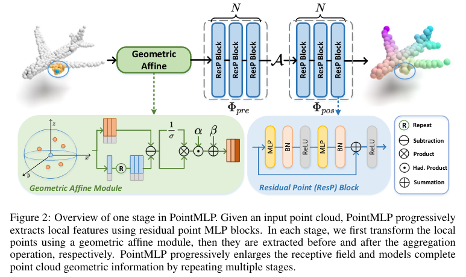
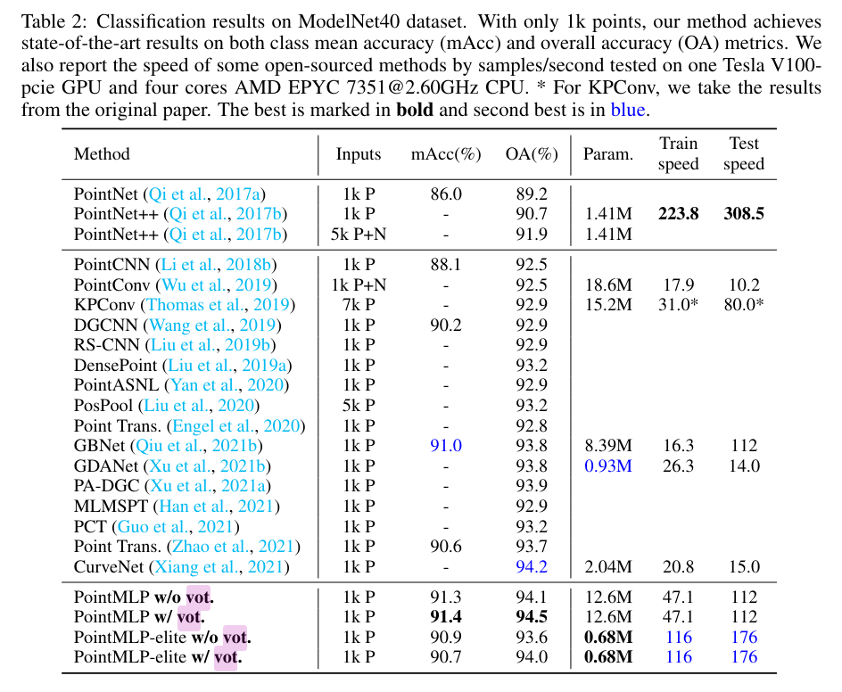
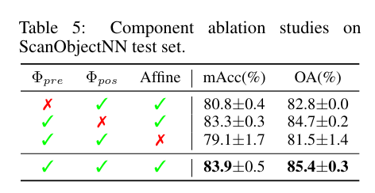

Rethinking Network Design and Local Geometry in Point Cloud: A Simple Residual MLP Framework
===

Xu Ma, Can Qin, Haoxuan You, Haoxi Ran, Yun Fu

https://arxiv.org/abs/2202.07123

@cohama

# どんなもの？

- PointMLP として点群界隈ではよく知られている手法
- PointNet++ を素朴に拡張して Deep にしたもの
- 単純だが高速、高精度を達成

# 先行研究と比べて何がすごい？

- PointNet/PointNet++ 以降、点群をボクセルや画像等に変換せずにそのままネットワークで扱う手法が増えた。
- PointNet++ 以降の改善はいかに局所的な特徴を計算するかが焦点になっている。畳み込み、グラフ、アテンションなど
- 提案手法はこれらの複雑な計算を用いずシンプルに MLP (Multi Layer Perceptron) だけを使ったモデルアーキテクチャを設計

# 技術や手法の肝は

## 前提知識 PointNet++

- SA (Set Abstraction) モジュールというのがある。
  - Sampling → 既存の点から適当に N 個選ぶ
  - Grouping -> N 個の選んだ点のうち半径r以内にある点を K 個選んでグループ化
  - PointNet -> 点ごとに MLP したあと Average Pooling でグループ化された点の特徴を混ぜる。後者は Reduction

## モデルアーキテクチャ

### PointMLP

Residual な構造を持っている。
Pre と Post に分かれている

### Geometric Affine

Residual な構造を持っていると言っても単純に深くしてもうまくいかない。
これはグループごとに異なるスケールの構造を直接扱っているためと予想。
近傍の点を集約する際に以下のようにノーマライズする。

### Elite バージョン (軽量版)

より高速なバージョンとして PointMLP-elite というバージョンも考案。Bottleneck 的な構造を導入してパラメータ数を減らす。

# どうやって有効だと検証した？

## 点群分類

## Ablation

### 深さ

### 各コンポーネント

Affine が効いている

当時の SOTA 達成。vot は Voting Strategy という手法？

- PointNet++ (https://arxiv.org/abs/1706.02413) 偉大な先行研究。この手法のベースになっている
- RepSurf (https://arxiv.org/abs/2205.05740v2) 先々月読んだ。入力となる点群に特徴を追加する方式なので本手法と組み合わせられるかも
- PointTransformer (https://arxiv.org/abs/2012.09164) 参照されている
- PointNext (https://arxiv.org/abs/2206.04670v1) 先月読んだ。PointMLP と同じ方向性の後発の手法。モダンな学習手法、オーグメント、ネットワークアーキテクチャを採用している

