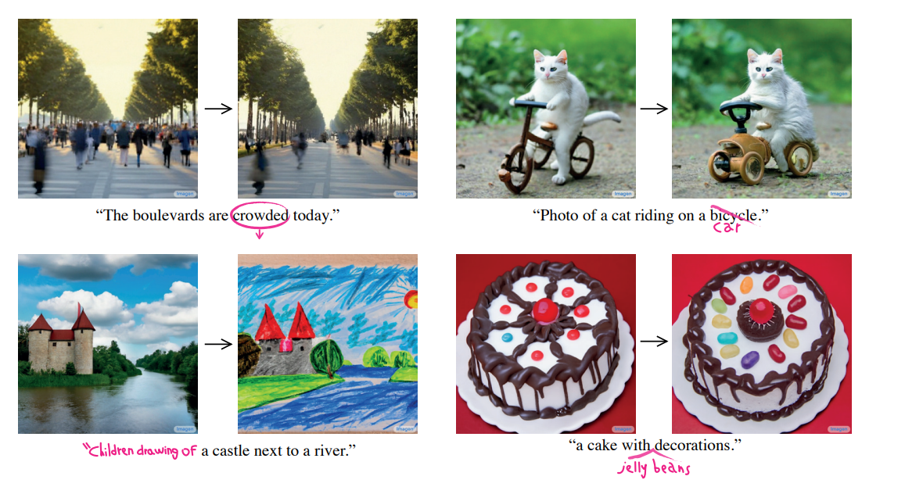
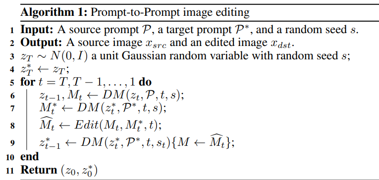

# Prompt-to-Prompt Image Editing with Cross Attention Control
[https://arxiv.org/abs/2208.01626](https://arxiv.org/abs/2208.01626)
(まとめ @n-kats)

著者
* Amir Hertz
* Ron Mokady
* Jay Tenenbaum
* Kfir Aberman
* Yael Pritch
* Daniel Cohen-Or

Google research の人たち

# どんなもの？
最近流行りの文章から画像を生成する系で、生成ではなく編集を行う研究。

# 先行研究と比べてどこがすごい？
素朴に、テキストを変えると全然違うレイアウトの画像ができてしまう。原型を留めるために、先行研究では人手でマスクを指定するなどの手順が必要だった。

この手法は、テキストの変更内容を指定するだけで画像を編集することができる。

# 技術や手法の肝は？
## テキストから画像を生成する手法
diffusion model と呼ばれる画像生成手法がある。これにテキストの情報を組み込む方法で画像生成をするのが研究されている。

この手法ではImagenをベースにしている。

### diffusion modelによる画像生成
画像を与えると、そのノイズを（少し）取り除くモデルを使った生成モデル。

* 最初にノイズ画像を用意する
* ノイズ除去を少しする
* ノイズ除去を少しする
* ...
* ノイズ除去を少しする
* ノイズが少ない画像が得られる

完全にランダムな画像から生成したり、一部だけノイズをかけて生成するなどの方法がある。

逆に、取り除くべきノイズを加えて、もとになるノイズ画像を作ることができる（正確には作れない）

### テキスト情報の組み込み
トランスフォーマー系のモデル。Query,Key,Value を次のようにつくる

* Q: 画像（ノイズ画像など）に対応する特徴マップから作成
* K: テキスト（をベクトル化したもの）から作成
* V: テキスト（をベクトル化したもの）から作成

の式でアテンションマスクを作り、MV をアウトプットする。

アテンションを可視化すると、次のようになる。マスクが、単語に対して画像のどこ（M）に情報（V）を出すかのを意味しているのがわかる。

（ノイズ除去をしていく中でのマスクの平均が可視化されている）

## 本手法のアイデア
生の画像を編集するのは一手間かかる。まずは、*生成した画像を更に編集する問題*を考える。

* 編集によって、基本的なレイアウトを保ちたい。
* レイアウトはアテンションマスクが保持している。
* 元画像のアテンションマスクを流用・加工して、目的画像を生成する。

### アルゴリズムの流れ

* $DM$: diffusion model のtステップの処理
* $z_t$: 元画像のtステップ目の状態
* $M_t$: 元画像のtステップ目のマスクの内容
* $z^*_t$: 生成画像のtステップ目の状態
* $M^*_t$: 生成画像のtステップ目のマスクの内容
* $Edit$: 元画像の生成画像のマスクを混ぜ合わせる処理（処理内容によって計算が異なる）
* $DM(\dots)\{M\leftarrow \hat{M_t}\}$: マスクを取り替えてdiffusion modelのステップを実施

## $Edit$ の中身
### 単語の置き換え

ステップ数で切り替えをおこなう。初期は、ほぼノイズで、元画像のベースを作っている段階のため、そのままマスクを流用。途中から目的の単語に対応したマスクに切り替える。

### フレーズの追加

追加するフレーズに対応したマスクを追加する。

### 重み調整

特定の単語部分の重みを大きくしたければ、対応するマスクを大きくする。

## 画像の編集
生成した画像を編集するのではなく、ただの画像を編集する方法について。

それには、まず、もとになるノイズ画像や乱数を用意しないといけない。

diffusion modelを逆用して、ノイズ画像を作る（単純にノイズを加えるのではうまく行かない）。

とはいえ、この逆算は完璧ではない。

逆算がうまく行っていない部分は元画像を使うようにして生成をコントロールする。

たれているはずの猫の耳がピンとなってしまうので修正する。

# どうやって有効だと検証した？
生成結果の通り

# 議論はある？
以下の課題がある

* 画像を良いノイズ画像に戻すのが難しい
* 特徴マップの解像度が低く、細かい位置に関する調整ができない
* ものを移動させるような編集ができない

# 次に読むべき論文は？
* Imagen
