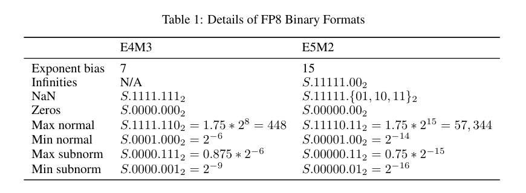
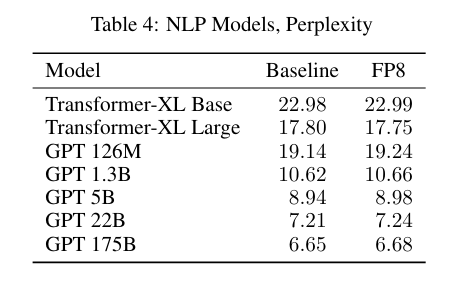

FP8 Formats for Deep Learning
====
Paulius Micikevicius, Dusan Stosic, Neil Burgess, Marius Cornea, Pradeep Dubey, Richard Grisenthwaite, Sangwon Ha, Alexander Heinecke, Patrick Judd, John Kamalu, Naveen Mellempudi, Stuart Oberman, Mohammad Shoeybi, Michael Siu, Hao Wu

(NVIDIA と Intel と ARM の人たち)

https://arxiv.org/abs/2206.02915

@cohama

# どんなもの？

- ニューラルネットを FP8 (8ビット浮動小数点数) で訓練、推論する
- DL の特徴に合致したフォーマットを考えた
- とくにモデルサイズやハイパーパラメータを変えずとも様々なタスクで FP16 とほとんど精度的に変わらない結果が得られた
- 推論も int8 よりすこし早い

# 先行研究と比べて何がすごい？

- FP8 を利用すること自体には先行研究がある
  - 重み、活性、勾配すべてに FP8 を使う
- 巨大 Transformer モデルでも精度の比較実施 (パラメータ数 175B)

# 技術や手法の肝は？

E4M3 (指数部が4ビット、仮数部が3ビットのフォーマット) と E5M2 (指数部が5ビット、仮数部が2ビット)

E4M3 だと無限大を表現せずにすべて NaN で表現する。

重みと活性には E4M3 を、勾配には E5M2 を使うのが推奨。ただしネットワークによっては片方だけでもいい場合もある。

# どうやって有効だと検証した？

## 画像分類で FP16 と FP8 の比較

## 自然言語

## 推論

Mixed Precision で訓練した後 FP8 でポストトレーニング量子化 (PTQ) を行う。

# 議論はある

- (結局この論文の貢献がなにかがいまいち分からなかった)
  - fp8 の先行研究はすでにある。巨大なモデルでも検証したこと？

# 次に読むべき論文は

Xiao Sun, Jungwook Choi, Chia-Yu Chen, Naigang Wang, Swagath Venkataramani, Vijayalakshmi (Viji) Srinivasan, Xiaodong Cui, Wei Zhang, and Kailash Gopalakrishnan. Hybrid 8-bit floating point (hfp8) training and inference for deep neural networks. In H. Wallach, H. Larochelle, A. Beygelzimer, F. d'Alché-Buc, E. Fox, and R. Garnett, editors, Advances in Neural Information Processing Systems, volume 32. Curran Associates, Inc., 2019.
