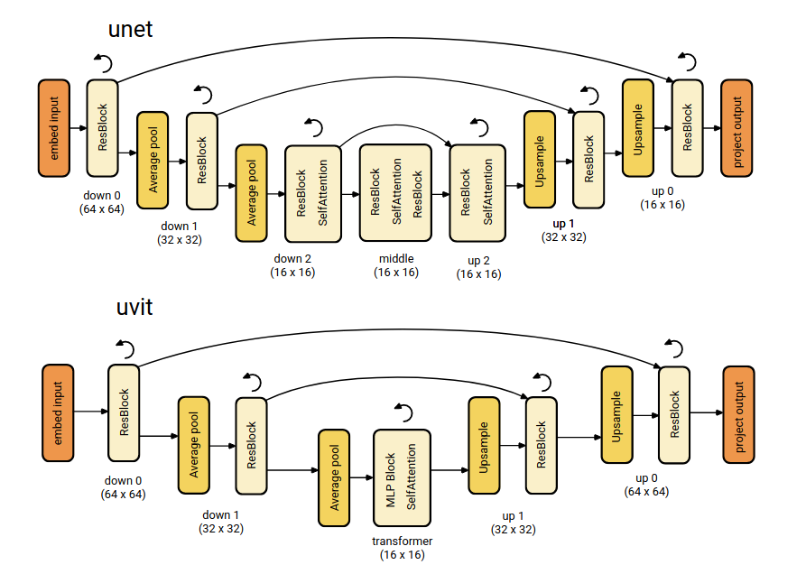
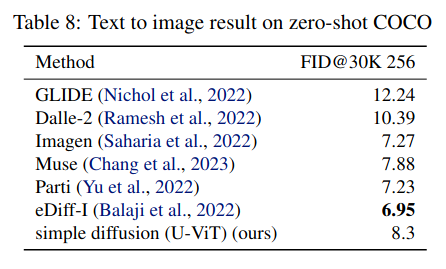

simple diffusion: End-to-end diffusion for high resolution images
===

Emiel Hoogeboom, Jonathan Heek, Tim Salimans

(Google Research の人たち)

https://arxiv.org/abs/2301.11093v1

@cohama

## どんなもの?

- Diffusion Model (DDPM) の改良手法の1つ
- 超解像やカスケードなどの複雑な手順なしに End-to-End で高解像度な画像の生成が可能

## 先行研究と比べて何がすごい？

これまでは拡散モデルで高解像度な画像を生成するには様々な工夫をこらす必要があった。

- Auto Eencoder の潜在空間上で Diffusion Model を使う (Latent Diffusion)
- 複数の Diffusion Model をカスケードさせて超解像させる (cascaded diffusion)
- Mixture-of-denoising-experts (アンサンブル的なやつ？詳細不明)

この論文では上記のような工夫をせずに1つのニューラルネットで End-to-End で高解像度な画像生成を行える。

## 技術や手法の肝は？

### 背景: DDPM

- 元の画像に対してノイズを加えていく過程を考える。
- ある xt からすこしだけノイズを除去した画像 xt-1 を推論するモデルを学習する
- 純粋なノイズから初めて T 回ノイズを除去すると最終的にきれいな画像が得られる。

### 工夫1: ノイズのスケジュール

入力画像に与えるノイズの大きさを決定するパラメータとして α と σ がある。

α は入力画像とノイズの割合 (SN比のようなもの)、σ はノイズの分散の大きさ。
よく使われる設定として

- α = cos(πt/2)
- σ = sin(πt/2)

というものがある。t=0 のときα=1、σ=0 なので入力画像そのもの。t=1 のとき α=0、σ=1 で純粋なノイズになる。

しかし、この設定は DDPM の登場初期に CIFAR-10 (32x32) や ImageNet (64x64 に縮小したもの) の画像生成向けに作られたもので高解像度な画像ではこのスケジュールは正しくない。
ネットワークの途中で Average Pooling などでダウンサンプリングを行うがこれにより相対的にノイズが薄まってしまう。

上の図は 512x512 のノイズ入り画像を 64x64 に Pooling した場合。t が小さい場合ほとんどノイズを与えられておらず t=1 付近で急激にノイズが増える。これでは学習が難しい。
詳細な計算は省くが 64x64 のノイズスケジュール設定を元に 128x128 の入力画像に適用するには 4 倍 (2^2) の SN 比になるようにすると良い。

### 工夫2: Multiscale Loss

フィーチャーマップの各解像度ごとに Loss を計算する。

### 工夫3: Scaling Architecture

高解像度なフィーチャーマップを持つネットワークはメモリ使用量が大きく計算コストが高い。
実は入力された画像を直ちにダウンサンプリングしても性能的の問題がないということが実験的に分かった。
ダウンサンプリングには離散ウェーブレット変換を使う方法のほかにカーネルサイズ d、ストライド d で畳み込む方法もある。

### 工夫4: Dropout

低解像度のフィーチャーマップにだけ Dropout を加えるとうまく行く

### 工夫5: U-Vit アーキテクチャ

低解像度のフィーチャーマップでは畳み込みの変わりに MLP を使う。Diffusion Model では伝統的には Self Attention が含まれるので Conv を MLP にすることで標準的な Transformer になる。
MLP の方が巨大なモデルを訓練しやすい。

ダウンサンプリングとアップサンプリングの部分は通常の U-Net のように畳み込みを使う

## どうやって有効だと検証した？

### 生成結果

### 他の生成手法との比較

### text-to-image

## 議論はある?

(私見)
- かなりシンプルな手法で Diffusion Model をスケールさせることができている。素直にすごい
- ほとんどニューラルネットで記述されているのでこれをベースにさらに改良された手法がこれから出てくることを期待

## 次に読むべき論文

- DDPM: Denoising Diffusion Probabilistic Models (https://arxiv.org/abs/2006.11239)
- A. Diffusion models beat gans on image synthesis (Diffusion Models Beat GANs on Image Synthesis) ADM と呼ばれる高解像度画像生成手法
- Cascaded diffusion models for high fidelity image generation (https://arxiv.org/abs/2106.15282) 複数の拡散モデルで高解像度を生成する手法
- High-resolution image synthesis with latent diffusion models (https://arxiv.org/abs/2112.10752) 潜在空間上で拡散モデルで使うやつ。Stable Diffusion でも使われている。
- On the Importance of Noise Scheduling for Diffusion Models (https://arxiv.org/abs/2301.10972v2)
  - ほぼ同時期に同じ Google が出したノイズスケジュールを調整するといいという同じような主張の論文。
