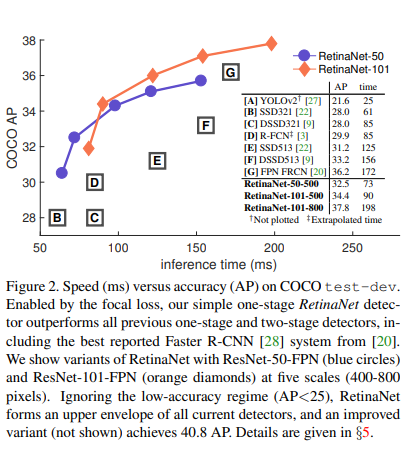
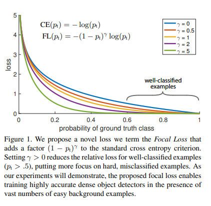

# **2023-4-12 Focal Loss for Dense Object Detection**
<https://arxiv.org/abs/1708.02002>
### **著者**
[Tsung-Yi Lin](https://arxiv.org/search/cs?searchtype=author&query=Lin%2C+T) , [Priya Goyal](https://arxiv.org/search/cs?searchtype=author&query=Goyal%2C+P) , [Ross Girshick](https://arxiv.org/search/cs?searchtype=author&query=Girshick%2C+R) , [Kaiming He](https://arxiv.org/search/cs?searchtype=author&query=He%2C+K) , [Piotr Dollár](https://arxiv.org/search/cs?searchtype=author&query=Doll%C3%A1r%2C+P)

2017 年 8 月 7 日に提出 ( [v1](https://arxiv.org/abs/1708.02002v1) )、2018 年 2 月 7 日に最終改訂

# **どんなもの？**
- one-stageのアプローチがtwo-stageに精度面で劣る理由を調査 
  - 前景-背景クラスの不均衡が原因である事を特定した(画像のほとんどが背景なので、背景かどうかを判定すればOKになる)
- クロスエントロピー損失を変形させて、不均衡に対処する事を提案（**Focal loss**） 
  - 膨大な数の負事例の影響を小さくする
  - これの有効性を評価するためにRetinaNetと呼ぶ単純な検出器を設計し、学習させる 
    - 既存の全てのtwo-stage検出器の精度を上回りながら、one-stageの検出器の速度に匹敵する結果を得た
# **先行研究と比較**
- 先行研究の話 
  - これまで最高精度の物体検出器は、R-CNNのようなtwo-stageのアプローチ 
    - 分類器は候補物体位置の疎な集合に適用される（？）
  - one-stageの検出器は高速・シンプルになる可能性があるが、two-stageのものと比較して精度が劣る。
- SOTAとの比較 
  - 
    
# **技術や手法のキモは？**
- #### **損失関数関連**
  - 通常のCross Entropy    
        
     
    - 背景の分類のような簡単で量の多い分類問題に学習が支配される事がある（例えば図1の青線の横軸0.5の損失が結構大きい）。
    - その結果難しい事例の精度に悪影響があるかも
  - Balanced Cross Entropy 
    - クラス間の不均衡を考慮して小さくするためのαを導入。便宜的に、各クラス出現頻度の逆数を重みに用いることで対処する      
      
  - Focal Loss 
    - αは正事例/負事例の重み調整は出来るが、focal lossは難しい事例の重みを強くすることで性能を向上させる

      
    - 性質 
      - ptが小さい（難しい事例）では係数は1になり、CEと同じ（重みの割引なし）
      - ptが1に近づく（簡単な事例）ほど重みが割り引かれる
      - 簡単な事例の重みの下げ具合をγでコントロール
      - γ=0だとCEと同じ
      - 
      
    - 実際には以下のαを付けた形式の方が精度高いので、こちらを採用
      
      
- **RetinaNet関連**
  
  
  ----------------------------------------------------------------
  - バックボーンネットワークと2つのタスク固有のサブネットワークからなる単一の統一されたネットワーク 
    - ResNetアーキテクチャの上にFPNバックボーンを使用
      - FPNなしでResNetの最終出力だけを使った場合AP低かったらしい
    - このバックボーンにアンカーボックスを分類するためのサブネットワーク(c)とanchor boxからground truthのboxに回帰するためのサブネットワークを付加している
  - anchor 
    - RPNと同様のアンカーボックス（？）
  - 分類サブネットワーク 
    - 参考文献28のFaster R-CNNの手法とは対象的に、層が深く3\*3convsのみを使用し、box回帰サブネットワークとパラメータを共有しない
    - 出力のKAはK個のアンカーとK個のオブジェクトクラスの確信度に相当
  - box回帰サブネットワーク 
    - 出力の4AはA個のアンカー座標に相当。「4」は左上のx, 左上のy, 右下のx, 右下のyに相当
# **どうやって有効だと検証した？** 
- 完全畳み込みone-stage検出器によって有効性を実証 
  - 精度・速度でSOTA達成
- データ 
  - COCOベンチマークのバウンディングボックス検出
- 学習 
  - 一般的な手法
  - COCO trainval 35k split（80kの訓練画像と40kの評価用画像からランダムに選んだ35kのサブセットからなる）を使って精度と速度のトレードオフを評価
  - 残りの5kでで評価する
  - COCO APをメインにreportする
- 共通の設定 
  - 深さ50 or 101のResNetsを使用して、その上にFeature Pyramid Networkを構築
  - 600pixelの画像スケールを学習とテストに使用
- 個別の試み

 
- 損失関数 
  - 通常のcross entropy（CE） 
    - 学習中にネットワークが発散するため、失敗する
    - 物体を検出する事前確率がπ=0.01となるように最終層を初期化するだけで効果的な学習が可能になる（4.1節）
    - RetinaNetをResNet50で学習させ、この初期化によりCOCOで30.2のAPが得られている。
  - balanced cross entropy（3.1節で解説） 
    - αバランスCE loss
    - 表1(a)：様々なαで試した結果
    - α=0.75でAPが0.9向上した 
      - （α=0.5と比較すると0.9上がったということだと思う
  - focal loss 
    - γが大きくなるに連れてCEより良いAPになる。γ=2の場合、αバランスCEに対して2.9AP改善（表1(b)） 
      - 31.1→34.0
      - 公平な比較のため、各γに対して最適なαを見つける
      - より低いαがより高いγのために選択された
  - focal lossの分析
  - Online Hard Example Mining (OHEM) 
    - あまり良い結果にならなかった
  - Hinge Loss 
    - あまり良い結果にならなかった
- 事例数の偏りの影響

  - 内容 
    - モデルを多数のランダム画像に適用し、10^7のnegative windowと10^5のpositive windowの予測確率をサンプリング
    - positive・negativeに分けてFLを計算し、合計が1になるように正規化
    - 正規化された損失が与えられると、損失を最低から最高にソートし、正負の両方のサンプルとγの異なる設定について、累積分布関数をプロット
    - 正負のサンプルの累積分布関数を示した
  - 解釈 
    - 正事例はγによらずグラフの形状は似ている
    - 負事例はγが大きくなるに連れて困難な負事例（右側）に重みが集中する。例えば紫の線
# **議論はある？**
# **次に読むべき論文は？**
- [11] R. Girshick, J. Donahue, T. Darrell, and J. Malik. Rich feature hierarchies for accurate object detection and semantic segmentation. In CVPR, 2014. 1, 2, 5　（R-CNNの論文。two-stageの手法良く分かっていないので）
- これより後に出た精度の良いone-stageモデルの論文
