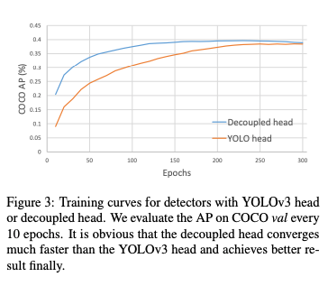
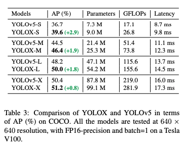

# YOLOX: Exceeding YOLO Series in 2021
https://arxiv.org/abs/2107.08430

(まとめ @masahiro6510)

### 出版年月
2021年8月

### 著者
Zheng Ge∗ Songtao Liu∗† Feng Wang Zeming Li Jian Sun
Megvii Technology

## どんなもの？

- YOLOシリーズの改良版としてYOLOXを提案
    - YOLO検出器をアンカーフリーにした
- 開発者や研究者が使いやすくするために公式リポジトリで、ONNX、TensorRT、NCNN、Openvinoに対応したデプロイ版も提供されている。(htt
ps://github.com/ Megvii-BaseDetection/YOLOX)

## 先行研究と比べて何がすごいか？
- 当時の最新のYOLO(v4, v5)にアンカーフリー検出器を取り入れた

## 技術や手法の肝は？
### 実装の詳細
- YOLOXも提案モデルもハイパーパラメータ等の設定は同じ

### ベースラインモデル
- YOLOv3に以下の改良を加えてCOCOのAPが38.5まで精度を改善したものをベンチマークとして使用
    
#### 分離head
分類タスクと回帰タスクが衝突し精度が下がる問題が知られているが、これまでのYOLOシリーズや特徴ピラミッド(FPN, PANなど)では2種類の検出ヘッドが結合されている。
結合された検出ヘッドが性能を損なう可能性があることを実験により明らかにした

1. 分離headにすると収束が早くなる

2. YOLOのE2E版では分離Headが不可欠（後述）。実際に通常のYOLOと分離head版のYOLOを比較すると、後者の方が精度高い

#### より強いデータAugment
YOLOv3にMosaicとMixUpを追加（これ自体は元からある手法）。これにより、AP42%に改善した。

#### アンカーフリー
yolov4, v5はyolov3のアンカーベースの手法を採用しているが、これには以下の問題がある
- 良い感じのアンカー設定しないといけないし、どんな設定が良いかはドメイン固有で一般化されていない
- アンカー設定次第で計算量が変わる。エッジデバイスで使う場合とかだとここがボトルネックになることがある

そこで、アンカーフリーの検出器を採用。これにより、42.9%APに改善した。
- アンカー経由せず左上の座標・幅・高さを出力する
- 各物体の中心位置を正事例として割り当てる

#### Multi Positive

#### SimOTA

#### End-to-End YOLO
NMSなしで似たようなことが出来る先行研究の手法を試したが、精度が落ちた。

## どうやって有効だと検証した？
### ベンチマークモデルとの比較
いろんなYOLOバックボーンでYOLOXを試したところ、どのバックボーンでも精度が向上した。

モバイル機器向けにモデルサイズ小さくしたやつ(Nano)

モデルサイズが変わると適切なAugment法も変わる。小さいモデルでは弱めのAugment, 大きいモデルでは強めのAugmentが良い。

### SOTAとの比較

## 議論はある？

## 次に読むべき論文
